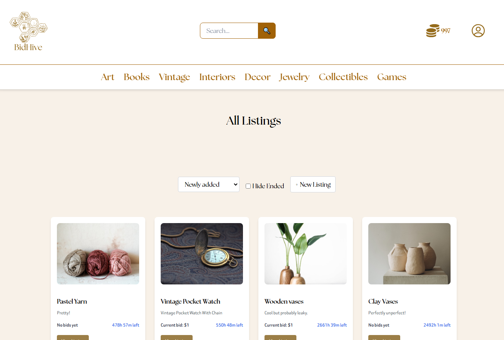

# BidHive — Auction House

A simple overview of the use/purpose of the project.

BidHive is a modern auction platform where users can browse listings, place bids, and manage their profiles. It focuses on clear UX, responsive layout, and straightforward interactions.

## Description

BidHive is a web-based auction platform that integrates with the Noroff Auction API (v2). Authenticated users can create listings and place bids, while all visitors can browse and search auctions with sorting and filtering options.

**Highlights:**
- Browse, search, and filter auction listings
- Place bids on active auctions (login required)
- Create, update, and delete your own listings (login required)
- Profile management (avatar, banner, bio, credits)
- Responsive, accessible UI with clean, modular JS

## Built With

- HTML5
- CSS3 + Tailwind CSS
- JavaScript (ES Modules)
- Vite
- Axios
- Noroff Auction API v2

## Getting Started

**Prerequisites:** Node.js 18+ and npm.

**Install:**
1. Clone: `git clone <your-repo-url>.git`
2. `cd <your-project-folder>`
3. Install deps: `npm install`
4. Create a `.env` in the project root with: `VITE_API_KEY=your-noroff-api-key-here`

**Run:**
- Dev server: `npm run dev`
- Build: `npm run build`
- Preview: `npm run preview`

## Contact

- Portfolio old version : <https://idatoldportfolio.netlify.app/>
- LinkedIn: <https://www.linkedin.com/in/ida-charlotte-loriann-toldn%C3%A6s-920190117/>
- Email: <idatoldnaes@icloud.com>
